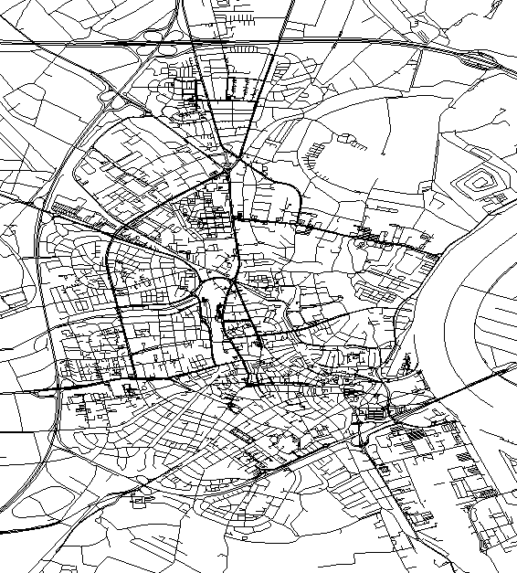

# a-star-cities

Project is currently work in progress.

The current implementation is just a simple custom renderer for open street map data.

The map data can be downloaded via the [open street map API](https://wiki.openstreetmap.org/wiki/Downloading_data).
The data must then be saved as .osm file to be used by the program.

## Example

## Dependencies

[SFML 2.6.0](https://github.com/SFML/SFML/releases/tag/2.6.0) 
[pugixml v1.14](https://github.com/zeux/pugixml/releases/tag/v1.14) 
[mapbox/earcut.hpp v2.2.4](https://github.com/mapbox/earcut.hpp/releases/tag/v2.2.4)
